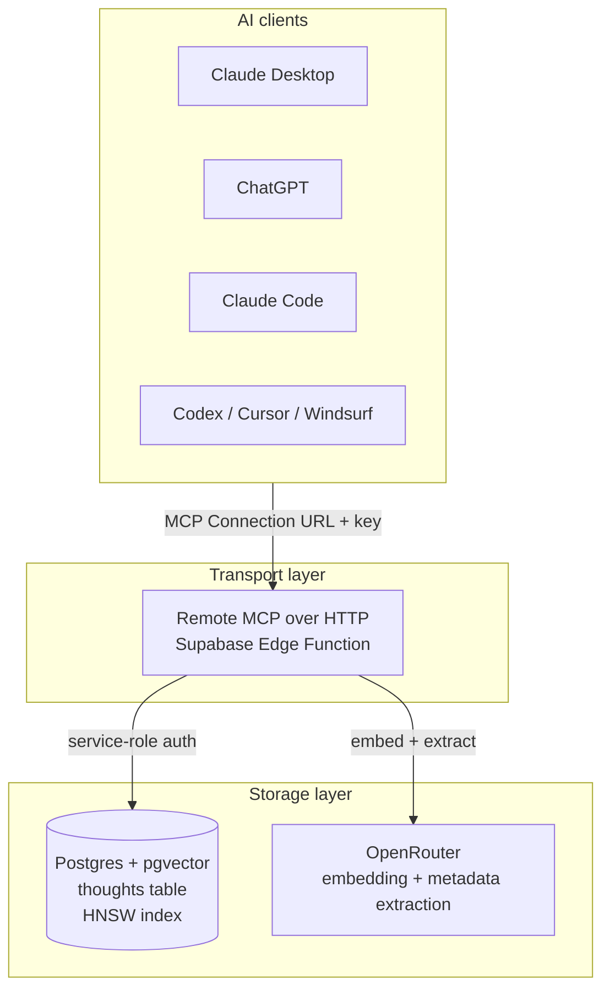

Open Brain is three pieces stitched together. Each is replaceable; none is fancy.

## The three layers



## Storage: Postgres + pgvector

A single project in Supabase. One required table:

```sql
create table thoughts (
  id uuid default gen_random_uuid() primary key,
  content text not null,
  embedding vector(1536),
  metadata jsonb default '{}'::jsonb,
  created_at timestamptz default now(),
  updated_at timestamptz default now()
);

create index on thoughts using hnsw (embedding vector_cosine_ops);
create index on thoughts using gin (metadata);
create index on thoughts (created_at desc);
```

Three indexes — vector for similarity, GIN for JSON metadata filters, B-tree for time-range queries. RLS is on; only the service role can read or write.

A single SQL function (`match_thoughts`) handles ranked semantic search with metadata filtering in one query.

<Note>
You can add tables freely (CRM contacts, taste preferences, calendar events). You **cannot** modify or drop the core `thoughts` table — that's the upstream contract every extension assumes.
</Note>

## Transport: remote MCP via Edge Functions

Open Brain ships exactly one Edge Function: `open-brain-mcp`. It's a Deno-runtime function deployed on Supabase that speaks the Model Context Protocol over HTTP.

Why remote (not local)?

- **No client-specific config files.** No `claude_desktop_config.json`, no per-machine setup.
- **Works on mobile and web clients** (ChatGPT, Claude.ai web) which can't run local stdio servers.
- **One URL, one secret** — paste it into any MCP-capable client and you're done.

Auth is intentionally simple: a long random key (`MCP_ACCESS_KEY`) passed either as a query parameter (`?key=...`) for clients that don't support custom headers, or as `x-brain-key` for clients that do.

## AI gateway: OpenRouter

OpenRouter is a single-key proxy in front of every major model. Open Brain uses it for two things:

- **Embeddings** (1536-dim) for the `embedding` column.
- **Metadata extraction** — lightweight LLM call that reads the thought and returns structured tags (type, people, topics, action items).

Why not OpenAI directly? One billing relationship, model-agnostic, swap providers without touching the function.

## Cost model

| Item | Cost |
| --- | --- |
| Supabase | Free tier covers most personal use |
| OpenRouter embeddings | ~$0.02 per million tokens |
| OpenRouter metadata LLM | ~$0.10/month for typical use |
| Edge Function invocations | Free tier: 500k/month |

At typical capture volume (a few hundred thoughts/month), expect **under $1/month** all-in.

## What this is **not** doing

- **No middleware.** Your AI talks directly to your database via MCP. No Zapier, no n8n, no relay servers.
- **No vendor lock-in.** Switching AI providers is one OpenRouter setting change. Switching storage is harder but not impossible (the schema is portable Postgres).
- **No "agent" framework.** Open Brain stores facts; the agent is whatever client you connect.

<Card title="See it in action" icon="play" href="/quickstart/overview">
  Build the whole stack in 45 minutes.
</Card>
