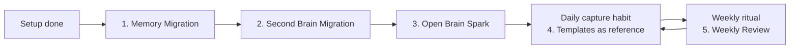

Open Brain is infrastructure. The companion prompts are the habits that make it compound — migrating your existing AI memories in, bringing your second brain over, discovering use cases for your specific workflow, building the daily capture habit, and running a weekly synthesis.

<Note>
The full prompt text lives in [`docs/02-companion-prompts.md`](https://github.com/NateBJones-Projects/OB1/blob/main/docs/02-companion-prompts.md) so you can copy-paste directly. This page is a guided index.
</Note>

## The five prompts

<CardGroup cols={2}>
  <Card title="1. Memory Migration" icon="brain-circuit">
    Extract everything your AI already knows about you and save it to your Open Brain. Run once per platform (Claude, ChatGPT, etc.) right after setup.
  </Card>
  <Card title="2. Second Brain Migration" icon="file-import">
    Bring existing notes from Notion, Obsidian, Apple Notes, Telegram, n8n, or plain text into your Open Brain. Format-agnostic.
  </Card>
  <Card title="3. Open Brain Spark" icon="lightbulb">
    Interview-style discovery of use cases tailored to your actual work, tools, and habits. Outputs your first 5 captures to make right now.
  </Card>
  <Card title="4. Quick Capture Templates" icon="bolt">
    Five sentence-starter patterns optimized for clean metadata extraction. Decision, person-note, insight, meeting debrief, AI save.
  </Card>
  <Card title="5. Weekly Review" icon="calendar-week">
    Friday/Sunday ritual. Pulls last 7 days of captures, surfaces themes, open loops, non-obvious connections, and gaps.
  </Card>
</CardGroup>

## When to use which

- **Prompt 1** — one-time per AI platform that has accumulated memory about you.
- **Prompt 2** — one-time per existing second-brain system you want to migrate from.
- **Prompt 3** — useful right after setup, then every few months as your workflow evolves.
- **Prompt 4** — reference card. After a week of capturing you won't need it; your own patterns will emerge.
- **Prompt 5** — Friday-afternoon or Sunday-evening ritual, every week.

## Quick capture template cheat sheet

These are the five copy-paste patterns from Prompt 4 that work especially well with the LLM-driven metadata extraction:

| Pattern | Template |
| --- | --- |
| Decision | `Decision: [what]. Context: [why]. Owner: [who].` |
| Person note | `[Name] — [what happened or what you learned].` |
| Insight | `Insight: [the realization]. Triggered by: [what made you think of it].` |
| Meeting debrief | `Meeting with [who] about [topic]. Key points: [...]. Action items: [...]` |
| AI save | `Saving from [AI tool]: [the takeaway worth keeping].` |

Why they work: the leading keyword (`Decision`, `Insight`, name-first, `Meeting with`, `Saving from`) gives the extraction LLM a clean signal for the `type` field. Names get pulled into `people`. Dates get pulled into `dates_mentioned`.

## Tools and clients

All prompts work with any MCP-connected AI (Claude, ChatGPT, Gemini, Grok).

- **Prompt 1** specifically requires an AI with memory accumulated about you.
- **Prompts 2 and 5** require your Open Brain MCP server connected (uses `capture_thought` / `list_thoughts`).

Pre-built AI assistants that already know these workflows:

- [Claude Skill](https://www.notion.so/product-templates/Open-Brain-Companion-Claude-Skill-31a5a2ccb526802797caeb37df3ba3cb?source=copy_link)
- [ChatGPT Custom GPT](https://chatgpt.com/g/g-69a892b6a7708191b00e48ff655d5597-nate-jones-open-brain-assistant)
- [Gemini GEM](https://gemini.google.com/gem/1fDsAENjhdku-3RufY7ystbS1Md8MtDCg?usp=sharing)

<Card title="Full prompt text" icon="github" href="https://github.com/NateBJones-Projects/OB1/blob/main/docs/02-companion-prompts.md">
  All five prompts in full — copy-paste ready.
</Card>
