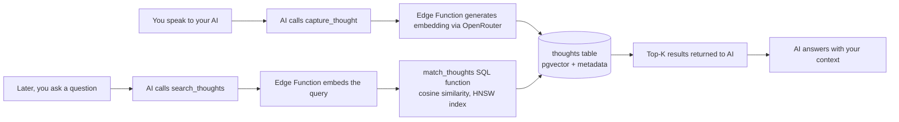

Open Brain has one loop. Everything else is layered on top of it.

## The loop in one diagram

## Capture path

1. You tell any connected AI: *"Remember this: Sarah mentioned she's thinking about leaving her job."*
2. The AI recognizes the intent and calls the `capture_thought` MCP tool.
3. The Edge Function receives the text. It calls OpenRouter to:
   - Generate a 1536-dimension embedding for similarity search.
   - Extract structured metadata (type, topics, people, action items).
4. A new row lands in the `thoughts` table — content, embedding, JSONB metadata, timestamps.

## Retrieval path

1. You ask: *"What did Sarah tell me about her job?"*
2. The AI calls `search_thoughts` with your query.
3. The Edge Function embeds the query and runs `match_thoughts(query_embedding, threshold, limit, filter)`.
4. Postgres uses the HNSW vector index to return the top-K most similar rows by cosine distance.
5. The AI receives the results and answers using them as context — exactly as if it had remembered.

<Tip>
Vector search is **associative**, not file-system-like. You don't need to remember what folder you put it in. Ask in plain language and the math finds it.
</Tip>

## Why this beats built-in AI memory

| | ChatGPT memory | Claude projects | Open Brain |
| --- | --- | --- | --- |
| Cross-tool | ❌ ChatGPT only | ❌ Claude only | ✅ Any MCP client |
| You own the data | ❌ | ❌ | ✅ Your Supabase |
| Vector search | ❌ Keyword | Partial | ✅ pgvector + HNSW |
| Extensible schema | ❌ | ❌ | ✅ Add tables freely |
| Cost at scale | Plan tier | Plan tier | ~$0.02 per million tokens |

## Four MCP tools, one URL

Every Open Brain exposes the same four tools:

- **`capture_thought`** — write a new thought with auto-extracted metadata
- **`search_thoughts`** — semantic search across everything you've captured
- **`list_thoughts`** — browse recent thoughts, optionally filtered
- **`thought_stats`** — high-level stats: row count, most-mentioned topics, etc.

Connect once. Every AI client that supports remote MCP gets the same four tools.

<Card title="See the schema" icon="table" href="/reference/thoughts-table">
  The exact columns, indexes, and SQL for the `thoughts` table.
</Card>
