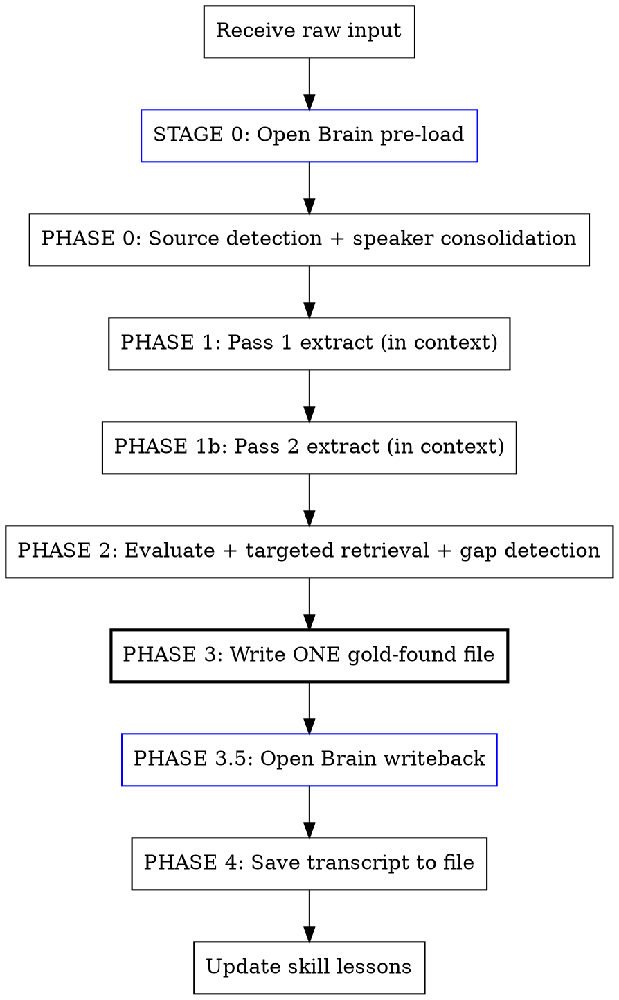

# Panning for Gold

## Overview

Transform raw brain dumps into evaluated, actionable idea inventories. Five phases: **Pre-Load** Open Brain context, **Extract** every thread without filtering, **Evaluate** the highest-signal ones with targeted retrieval and gap detection, **Synthesize** into a permanent gold-found file, then **Write Back** to Open Brain automatically.

**Core principle:** Open Brain is the memory. The transcript is the event. This skill bridges them. Every line gets examined, and every extraction is context-aware, connecting new information to what you already know. Nothing is dismissed as noise on the first pass. Personal threads, half-formed thoughts, and tangential observations often contain the highest-signal ideas.

## When to Use

- Voice transcripts (multi-speaker, timestamped)
- Stream-of-consciousness notes
- Brain dump markdown exports from ChatGPT/Gemini/Claude
- Any document where the user says "process this" or "what's in here"
- Multi-topic conversations that need thread extraction

**Do NOT use this skill for:**
- Podcast transcripts (a fit-score or podcast-notes recipe fits better)
- Live, in-session brainstorm capture (pairs with the [Live Retrieval](../live-retrieval/) recipe instead — it reads from Open Brain live and captures at session close; this one processes after the fact)

## Critical Rules (Learned from Production Use)

These rules exist because they've been violated and caused wasted work:

1. **ONE FILE: GOLD-FOUND.** No separate inventory file. Both extraction passes happen in-context, then ONE gold-found file gets written with all threads, evaluations, and connections. The gold-found file IS the inventory. The transcript gets saved at the END, since it's already in context during extraction. This alone saves meaningful token overhead versus writing an inventory, a gold-found file, and a transcript separately.

2. **SUMMARIES FIRST, TRANSCRIPT SECOND.** If a summary/notes file exists alongside a transcript, use the summary as the primary extraction source. Only read the full transcript for: (a) exact quotes to support threads, (b) verifying completeness on the second pass. This saves 10-20K tokens per scan.

3. **EVALUATORS WRITE TO FILES.** Every background evaluator agent MUST write its evaluation to a permanent file (e.g., `docs/meetings/evaluations/YYYY-MM-DD-{slug}.md`) as part of its task. Do not depend on collecting agent return values — they can be lost to context compaction.

4. **SYNTHESIS HAPPENS INLINE.** Do not dispatch a separate agent for synthesis. Write the gold-found file yourself after evaluators finish. If evaluators disappear, write the synthesis from your own reading.

5. **TWO PASSES ON TRANSCRIPTS.** Always run extraction twice. First pass uses summary + targeted transcript reads. Second pass is a verification scan for missed threads.

6. **CAP RETRIEVAL QUERIES.** Pre-load: max 8 search queries + 1 recency query. Evaluation: max 10 targeted queries. Total max: ~19 Open Brain queries per session. This prevents latency explosion.

7. **DOSSIER TOKEN CAP: ~4K.** If Open Brain returns more than 4K tokens of context, summarize aggressively. The transcript is the priority payload, not the dossier.

8. **TRUST THE TRANSCRIPT OVER OPEN BRAIN.** When the transcript contradicts a stored memory, the transcript wins. The transcript is the event. Open Brain is the memory, and memories can be wrong or stale.

## Process



## Stage 0: Open Brain Pre-Load

Before any extraction, build a context dossier from Open Brain. Added after noticing that extraction was treating every transcript as a stranger reading it, with no memory of people, projects, or prior conversations.

### Step 1: Entity Skim

Quick-read the transcript (or summary if available) to identify person names, business/product names, and dominant topics. Do NOT extract threads yet, just identify entities. Under 30 seconds.

### Step 2: Open Brain Queries (max 9 total)

**People queries (max 4):** for the top 4 people mentioned, prioritizing unknowns and key relationships:

```
search_thoughts(query="{person name}", limit=3)
```

**Entity/topic queries (max 4):** for the top 4 businesses, products, or topics:

```
search_thoughts(query="{entity or topic}", limit=3)
```

**Ambient context (1 query):**

```
list_thoughts(days=14, limit=10)
```

### Step 3: Check Your CRM (if you keep one)

If you maintain a lightweight contacts file, check whether mentioned people already have entries. Note communication style, last contact, and relationship context.

### Step 4: Assemble Dossier

Build a structured context block, capped around 4K tokens:

```markdown
## Open Brain Context Dossier
### People
- [Name]: [summary, last interaction, relationship, open items]
  Status: KNOWN (found) / PARTIAL (mentioned only) / NEW (not found)
### Projects/Products
- [Name]: [current state, recent activity, blockers]
### Active Context (last 14 days)
- [Recent session summaries, still-open action items]
```

### Degradation

If Open Brain is unavailable, or returns nothing useful for more than 75% of entities (e.g. a conversation with all new contacts), skip the dossier and run a standard two-pass extraction. Note "Open Brain pre-load: skipped" in the gold-found file header.

## Phase 0: Source Detection (run FIRST) + Save Raw Input

**Automated-pipeline branch.** Check whether the input arrives already committed through an automated pipeline (a meeting-notes tool, a transcription cron, a webhook) with a pre-generated summary and action items attached. If so:

- **Map speakers before extracting.** Some meeting tools label turns account-relatively ("Me" / "Them" from the note-taking account's perspective, not by name) rather than by identity. Confirm the mapping against a content anchor for each speaker before trusting it. If the export doesn't mark which participant is the note-taker, the anchor check becomes the primary mapping step, not a confirmation: require two independent content anchors (one per speaker) before extracting.
- Read the committed file in place. Do NOT paste-and-re-save; skip the Phase 4 transcript save entirely.
- **Watch for single-line exports.** Some transcript exports land as one very long physical line per turn (tens of kilobytes on one line). A naive read silently truncates and drops most of the content — the worst failure mode for a skill whose rule #1 is "read every line." Before reading, check chars-per-line; if it's very high, reflow the file into a scratch copy (wrap at a fixed width) and extract from the reflowed version. Never extract from a truncated read.
- Treat any pre-generated summary/action-items block as a first-pass candidate set to verify and dedup against, not as ground truth. Automated extractors mis-attribute and over-index just like any other extractor. Run Gap Detection (Phase 2) against that baseline to flag what it missed.
- Write the gold-found file per your routing convention, then close out the originating ticket/issue with a link.

**Generic path (pasted transcript, brain dump, or any other file).** Save the raw transcript/brain dump to a file if it isn't already saved, but do this AFTER Stage 0 pre-load and BEFORE extraction, not before analysis begins — the transcript is already in context, so saving it is bookkeeping, not a prerequisite. File naming: `docs/meetings/YYYY-MM-DD-{source}-transcript.md` or `docs/brainstorming/YYYY-MM-DD-{topic}.md`. Exception: if the transcript is already committed via the automated-pipeline branch, skip this save entirely (see Phase 4).

## Phase 0.5: Speaker Consolidation & Identification (Multi-Speaker Transcripts Only)

**BEFORE EXTRACTING THREADS:** Clean the speaker data. Voice transcripts with auto-generated speaker labels are actively misleading, not just unreliable. This is a data quality problem that must be solved before any analysis.

### Why This Exists

Added after a lunch-meeting transcript where 10 speaker labels were generated for a 2-person conversation. The same person got different labels across scenes (office, car, restaurant), and different people shared labels. 40+ threads were attributed to the wrong person, turning pain points into pitches and vice versa. The entire inventory had to be redone.

### The Problem (Quantified)

Typical voice transcription software re-assigns speaker labels when the environment changes, background noise shifts, volume/distance changes, or there's a brief pause or interruption. Result: a 2-person lunch meeting generated 10 speaker labels, one of which was attributed to BOTH participants at different points. The labels aren't just unreliable, they're actively wrong.

### Process

#### Step 0: Speaker-Label Presence Check

Before any other step, scan the transcript for speaker labels.

- **Labels present (even fragmented):** proceed to Step 1.
- **Labels absent (single continuous text stream, zero attribution):** STOP. This process cleans fragmented labels; it does not invent labels from scratch. Content-anchor-only attribution is unreliable for any speaker who shares biographical or work-context overlap with the primary user.

**When labels are absent**, ask the user: *"This transcript has no speaker labels. Is the original audio available?"*
- **Yes:** dispatch a diarization tool on the audio, align timestamps with the existing transcript, then re-enter this process with labeled input. Diarization is audio-domain only; it can't be retroactively applied to text alone.
- **No:** the batch-clarification step below (Step 5) becomes mandatory before extraction. Treat every load-bearing attribution as ambiguous, especially for speakers who share work context with the primary user (co-founders, collaborators), because the failure mode is silent and high-stakes.

#### Step 1: Ask the user FIRST (10 seconds, saves 30 minutes)

Before reading a single line: "Who was present?" / "Any other people who spoke briefly?" / "What was the setting?"

#### Step 2: Speaker Label Audit (automated)

Count lines per speaker label, sample 2-3 lines from each, compare expected speakers vs. actual labels. If `number_of_labels > (expected_speakers * 2)`, the labels are fragmented and CANNOT be trusted for attribution.

#### Step 3: Build Anchor Lines

From memory, your contacts file, and context, identify "unmistakable" lines per person — lines that could only have been said by one specific person.

**Your own anchors (stable across all transcripts):** references to family members by name, your specific projects/tools/frameworks, career history details only you would mention, hobby or interest references unique to you.

**Other-speaker anchors (build per-meeting):** workplace-specific vocabulary, system knowledge only an insider would have, budget/operational details, personal anecdotes unique to them.

#### Step 4: Scene-Based Re-Attribution

Segment by SCENE (environment change). Within each scene: identify anchor lines first, then use conversational flow (questions vs. answers, topic expertise) to attribute the rest. Mark confidence: HIGH / MEDIUM / LOW.

#### Step 5: Batch Clarification

Collect all MEDIUM and LOW attributions into ONE numbered list. Present to the user. Get all corrections in a single pass.

#### Step 5.5: Biographical Attribution Quiz (mandatory for any transcript with stakes)

**Why this exists:** learned after a repeated failure pattern where the primary user's own biographical details (a place they'd lived, a school affiliation) got projected onto the other speaker in a written artifact — not once, but twice on the same transcript, even after a correction had already been noted the first time. Root cause: fragmented speaker labels combined with a default habit of attributing ambiguous biographical claims to "the other person" instead of to the primary user.

**The fix:** before extracting threads, scan for biographical claims (school, alumni, country lived in, kids, family, military/career history, hobbies, life events) that appear in ambiguous speaker blocks. List them. Quiz the user on each one. Get verified attribution before writing any of them into a downstream artifact.

**Process:**

1. Scan for first-person biographical lines: "I lived in...", "I went to...", "My [family member]...", "I used to work as...", "I grew up in...", etc.
2. For each biographical line in an ambiguous block, build a quiz item with the line, the block's speaker label, and the default attribution (the primary user, per the rule below).
3. Present as one numbered batch: *"Before I extract threads, I need to verify a few biographical attributions. The default rule is that ambiguous claims belong to you, but I want to confirm: 1) '...' — you or [other speaker]? 2) ..."*
4. WAIT for answers before extracting threads. Do not guess. The cost of waiting is seconds; the cost of guessing wrong is a factual error in someone's permanent record.
5. **Default rule for ambiguous claims:** if a quiz item is unclear and the user can't immediately recall, default to the primary user. Better to leave a true detail off the other person's record than to put a false one on it.
6. Capture verified facts in a temp block at the top of working context before extracting.
7. All downstream extraction, evaluation, and gold-found writing MUST reference this verified block. Trust the quiz answers over the speaker labels.

**Suspicion list — auto-flag for the quiz:** anything that matches a detail already known about the primary user from your own memory system (hometown, alma mater, service/military background, number and ages of kids, career history, spouse's field, distinctive hobbies). If any of these show up attributed to someone else without explicit speaker confirmation, treat it as projection until proven otherwise.

#### Step 6: Produce Clean Transcript (Optional but recommended for high-value meetings)

Save a cleaned version with consolidated speaker names replacing label numbers as `YYYY-MM-DD-{source}-clean-transcript.md`. This becomes the canonical reference.

### Decision: Is Re-Extraction Needed?

- If >20% of threads change meaning with correct attribution: re-extract from scratch.
- If <20% but key pain-point threads are affected: targeted fixes.
- If corrections are mostly cosmetic: fix in place, proceed.

## Phase 1: Extract (Pan) — Open Brain Enriched

### Token-Efficient Reading Strategy

1. **Summary first:** read the summary if it exists. Extract all threads from it. This covers 80-90% of content in a fraction of the lines.
2. **Targeted transcript reads:** for each summary thread, pull one exact quote from the transcript with Grep, don't read the whole file.
3. **Second-pass verification:** read the last 30% of the transcript (conversations front-load business, end with personal/relationship threads that summaries often skip).

### Extraction Rules

1. **Read every line.** Voice transcripts have ideas buried in small talk. A casual conversation might contain a warm intro to a key contact.
2. **No category filtering.** Extract personal, professional, technical, creative, wellness, financial, relational threads equally. You don't decide what matters, the user does.
3. **Context is signal.** "I should have talked to her first" is a strategic insight, not filler.
4. **Tangents are features.** Stream-of-consciousness thinking links ideas the user hasn't consciously connected. Note the connections.
5. **Transcription artifacts are clues.** Garbled speech and interruptions mark moments of excitement or distraction, both worth capturing.

### Open Brain-Enriched Extraction

For each thread, capture the standard fields plus:
- **ob_connection:** what existing knowledge does this thread relate to? Use the Stage 0 dossier. If nothing connects, write "NEW — no prior."
- **person_status:** for each person mentioned: KNOWN, PARTIAL, or NEW.
- **project_fit:** does this thread connect to an active project? Name it and the connection, or leave blank.

### What to Extract

For each thread: the idea (1-2 sentences), an exact quote from the source, implicit connections to other threads or known projects, a category label (don't filter by it, just organize by it), plus the three enrichment fields above.

### Do NOT Save a Separate Inventory File

Keep all threads in context. They go directly into the gold-found file after both passes. No intermediate inventory file — it's redundant with the gold-found file's own thread list, and writing it separately wastes real tokens for no benefit.

### Present Thread Count (Brief)

After Pass 2, tell the user: "N threads (M with prior connections, K new). Writing gold-found now." Don't list every thread inline, they'll be in the file. If the user says you missed things, do a targeted re-read of specific sections, not the whole transcript.

## Phase 2: Evaluate (Brainstorm per Nugget) — Open Brain Enriched

### Pre-Evaluation Retrieval (max 10 queries)

Before evaluating, run targeted searches for the top 10 threads by potential:

```
search_thoughts(query="{thread topic + key person}", limit=3)
```

Use results to upgrade priority (thread maps to something you already built, or connects to an active deal, push toward ACT NOW), downgrade priority (thread duplicates something already captured, or contradicts a decision already made, push toward PARK), or flag contradictions between the transcript and your memory system.

### Triage First

Not every thread needs a full evaluation agent:
- **ACT NOW candidates (3-5 max):** full evaluation.
- **Already validated:** threads confirming prior sessions. Note, skip evaluation.
- **PARK candidates:** one-line verdict, no agent.

### Evaluation Approach (Efficiency-Ranked)

1. **Inline evaluation (preferred for 1-3 threads):** write it yourself in the gold-found file. Fastest, no agent overhead, no risk of lost work.
2. **Background agents (for 4+ ACT NOW threads):** dispatch agents that MUST write to permanent files.
3. **NEVER dispatch more than 5 background evaluators.** More than 5 means you miscategorized. Re-triage.

### Per-Idea Evaluation Template

```
You are brainstorming about a single idea extracted from a brain dump.

IDEA: {idea description}
CONTEXT: {surrounding context from transcript}
PRIOR CONTEXT: {relevant memory-system search results for this thread}
ACTIVE PROJECTS: {relevant active projects}

IMPORTANT: Write your evaluation to {output_file_path} using the Write tool before returning.

Evaluate this idea thoroughly:

1. What is this really? Restate the idea in its strongest form.
2. Why did this excite them? What need or desire does it serve?
3. Prior connection: what does your memory system already know about this topic/person/pain point?
4. Build vs Buy: does something already exist? Search GitHub. What's the delta?
5. Feasibility: how hard is this? Time estimate. Dependencies.
6. Connections: how does this connect to their existing thinking?
7. Verdict: ACT NOW (high value, low effort, unblocks something) / RESEARCH MORE (promising but needs investigation) / PARK IT (interesting but not timely) / KILL IT (not worth attention, explain why)
8. If ACT NOW or RESEARCH MORE: what are the next 3 concrete actions?

Be honest. Don't inflate value. Don't dismiss things as "someday" just because they're not code.
```

### Deadline Audit (mandatory)

Before writing any dated ACT NOW or WAITING_FOR item, audit every deadline claim. Added after "deadline inflation" — an ambiguous source time reference ("before Friday") got pinned to the nearest calendar date, creating urgency the source never established, and the resulting date propagated into several downstream artifacts before it was caught.

For each deadline claim:

1. **Is the date a literal quote from the source?** If yes, cite the exact quote and use the literal date. If no, go to 2.
2. **Is the date inferred from anchored context?** (e.g. a named meeting resolves to a specific date because it's the only such meeting on record). If yes, mark it `[inferred from: <anchor>]` and flag the inference. If no, go to 3.
3. **Is the date your own extrapolation?** If yes, remove the calendar date. Write the item as "respond promptly" or "before [anchor event]" without pinning a day. Do not manufacture a deadline the source doesn't establish.

**Default rule for source conflicts:** if two parts of your source material give different dates for the same item, flag the conflict explicitly and pick the conservative reading. Never silently pick the aggressive one.

**Downstream contract:** any file that references a dated ACT NOW from a gold-found file MUST cite the gold-found's evidence line or quote, so corrections propagate cleanly when an inferred date is later walked back.

### Gap Detection

After evaluation, explicitly answer:
1. **Missed threads:** what topics were discussed that Pass 1 didn't extract (conversational asides, throwaway comments that are actually gold)?
2. **Unmentioned prior context:** what does your memory system know that's relevant but neither speaker mentioned?
3. **WAITING_FOR items:** what commitments were made? Who owes whom what?
4. **New contact notes needed:** what new people need entries? What known people need updates?

Add any gap-fill items to the gold-found file.

### Agent Configuration

- Use `run_in_background: true` for all evaluators.
- Every evaluator MUST include instructions to write output to a permanent file.
- Match model tier to stakes: your strongest model for ideas connected to active/strategic projects, a mid-tier model for lower-stakes research, a fast/cheap model for quick feasibility checks.
- Output path: `docs/meetings/evaluations/YYYY-MM-DD-{idea-slug}.md`

## Phase 3: Synthesis

Write the gold-found file **yourself** (do not delegate to an agent). Collect from evaluation files, inline evaluations, and the in-context thread list.

### Gold-Found File Location

`docs/meetings/YYYY-MM-DD-{source}-gold-found.md`, or your own project's equivalent staging convention.

### Format

```markdown
# Gold Found: {date} {source}

**Source:** {transcript/brain dump description}
**Extraction method:** Open Brain-enriched two-pass (Stage 0 dossier + {N} queries)
**Thread count:** {N} ({M} with prior connections, {K} new)
**Open Brain Pre-Load:** {status: full dossier / partial / skipped}

---

## ACT NOW
{Full evaluation for each, with evidence quotes, prior connections, and next 3 actions}

## RESEARCH MORE
| # | Idea | Prior Connection | Question to Answer | Next Action |

## PARKED (No guilt, no deadlines)
| # | Idea | Prior Connection | Why Interesting | Trigger to Revisit |

## KILLED
| # | Idea | Why Not |

## Connections Discovered
- {idea A} connects to {idea B} because...
- {thread from transcript} validates {existing knowledge}
- {transcript contradicts prior record}: [what was said] vs. [what was recorded]

## Gap Detection Results
- Missed threads added: {list}
- Unmentioned prior context surfaced: {list}
- Contradictions found: {list}

## Human-Contact Check
Is there a human the user should talk to before doing more solo work on this?

## New Follow-Up Items
### WAITING_FOR
### New Contact Notes (new or updated)
### Calendar
### Decisions
```

## Phase 3.5: Capture to Open Brain

After writing the gold-found file, capture to Open Brain automatically (do not ask for permission).

> **Note:** if you have the [Live Retrieval](../live-retrieval/) recipe installed, it handles session-end captures automatically for live brainstorming. This phase still runs for panning because per-thread ACT NOW items are more granular than a session summary.

### What Gets Captured

1. **Each ACT NOW item** as its own `capture_thought`:
   - `content`: "ACT NOW: [one-line summary]. [Full evaluation: verdict, connections, next actions]. Origin: [transcript file path] > [gold-found file path] > Thread #N"

2. **Each new contact note** as its own `capture_thought`:
   - `content`: "[Name] — [role/company]. Met at [context]. Key details: [pain points, relationship notes]. Source: [transcript date and source]"

3. **A session summary** as one `capture_thought`:
   - `content`: "Panning session: [source], [N] threads, [M] ACT NOW, [K] with prior connections, [J] new entities. Gold-found: [file path]"

4. **Dedup:** if your Open Brain setup has an advisory dedup check, let it advise, never let it hard-block a capture. A duplicate is the acceptable worst case; a lost capture is not. If it flags a near-match, prefer capturing with a reference to the near-match over skipping the capture entirely. Learned the hard way: a hard-skip dedup gate destroyed several genuinely novel captures in one session, using a similarity comparison that was actually measuring topic overlap rather than true redundancy. An audit of months of ungated captures afterward found effectively zero real duplicate problems, while the guard itself had caused real losses.

This closes the flywheel: panning extracts and evaluates, Open Brain stores, live retrieval finds it next session.

### What Does NOT Get Captured

PARKED items and KILLED items stay in the gold-found file only. Duplicate content already captured doesn't get re-captured.

## Phase 3.6: Loose-Ends Sweep

Before saving, run a quick pass over the session: any "said I'd do X, didn't," unverified claim, or abandoned thread that survived extraction feeds back into the ACT NOW list.

## Phase 4: Save Transcript

**AFTER** writing the gold-found file and doing the writeback, save the raw transcript to a permanent file if it wasn't already saved in Phase 0. This is the archival step, not a prerequisite for extraction.

**Skip this phase entirely** when Phase 0 took the automated-pipeline branch — the transcript is already committed elsewhere, so re-saving duplicates it.

File: `docs/meetings/YYYY-MM-DD-{source}-transcript.md`. Include a brief header with participants, date, and context.

## Phase 5: Self-Improvement

After every panning session, check:
1. Did any work get lost (agents died, compaction ate something, files not saved)? Add a rule to Critical Rules.
2. Was token usage reasonable (unnecessary re-reads, too many agents dispatched)? Update the reading strategy.
3. Did the user correct the extraction (missed threads, wrong categorization)? Add to Common Mistakes.
4. Did the dossier improve extraction quality? Note which queries were most useful.
5. Were query caps hit? Adjust if needed.

If any lesson is learned, update this skill file directly. The skill improves with every use.

### Lessons Log

| Lesson | Change Made |
|---|---|
| Background evaluator agents lost to context compaction. Synthesis never written. | Added Critical Rules on permanent files and inline synthesis. |
| Re-reading a 900+ line transcript burned tens of thousands of tokens when a summary covered 90% of it. | Added "summaries first" strategy; use Grep for quotes instead of full re-reads. |
| An early-pass inventory wasn't saved to a file and was lost on a context reset. | Added a permanent-file save step, later replaced entirely by folding it into the gold-found file. |
| Ten speaker labels generated for a 2-person conversation; the same person got different labels across scenes, and different people shared labels. 40+ threads were misattributed. | Added Phase 0.5 speaker consolidation: ask who was present first, audit label counts, build anchor lines, scene-based re-attribution, and a decision framework for whether re-extraction is needed. |
| A first extraction pass produced 42 threads; pushing for completeness on a second pass found 82. Collapsing related threads and skipping "non-business" categories loses signal. | Default to over-extraction; ask if threads were missed; added to Common Mistakes. |
| Extraction treated every transcript as a stranger reading it, with no memory of people, projects, or prior conversations. | Added the Stage 0 pre-load dossier, connection tagging, and gap detection. Capped query counts to bound latency. |
| Saving the transcript first, plus a separate inventory file, wasted meaningful tokens versus doing both passes in-context first. | Killed the separate inventory file. One gold-found write. Transcript saved last. |
| A biographical detail belonging to the primary user got projected onto another speaker in a written artifact — twice on the same transcript, even after the first correction was noted. | Added the mandatory Biographical Attribution Quiz: scan for bio claims in ambiguous blocks, present as a numbered batch, wait for verified answers before extracting. Default ambiguous claims to the primary user, not the other person. |
| A deadline got inflated: an action item cited "before Friday," and the source contained two different dates for the same commitment. The aggressive reading got picked and propagated downstream before being caught. | Added the mandatory Deadline Audit: literal quote, inferred-from-anchor, or extrapolation. Extrapolations lose their calendar date. Conflicting sources default to the conservative reading. |
| A transcript with zero speaker labels (a single continuous stream) got panned by content-anchor guessing alone, without running speaker consolidation at all, and flipped attribution on two significant items. | Added a speaker-label presence check as the first step of consolidation. Absent labels require either audio-based diarization or mandatory batch clarification before any extraction. |
| A recording with more actual speakers than a diarization tool's supported ceiling produced labels that looked clean but weren't reliable signal; a rationalization ("prior context resolves it") skipped the bio-quiz and caused a real misattribution. | Rule: if a diarizer's speaker ceiling is exceeded by the recording's true speaker count, its labels are not trustworthy regardless of how clean they look; the bio-quiz becomes hard-mandatory in that case. |
| A source-preference rule ("prefer transcript source A over source B") that was true under one specific condition got written down as a blanket preference, then silently went stale for weeks when the underlying pipeline improved and reversed which source was actually better. | Rule: any "prefer X over Y" statement is an empirical claim with a shelf life, never an invariant. State the date, the evidence, and the condition under which it holds. Re-verify before relying on an old preference rule. |
| A timed-caption export was parsed with a regex that only matched single-line cues; the export wrapped long cues across multiple physical lines, so most of the transcript silently collapsed to near-nothing and the output read as plausible-but-vapid small talk instead of an obvious failure. A word-count sanity check caught it; a read-through did not. | Rule: for any timed-caption format, parse with a pattern that spans newlines, sort cues by timestamp before collapsing consecutive same-speaker turns, and corroborate parsed word count against a raw grep count before trusting the extraction. A shortfall over roughly 10% means the parser is wrong, not the meeting. |
| An unrecognized proper noun in a transcript was dismissed as a likely transcription garble because nobody in the room could place it. It turned out to be a real, load-bearing system referenced throughout separate source documents that arrived later. | Rule: an unrecognized acronym or name is an open question, never a resolved transcription error, unless a source artifact actually confirms the garble. Log it as a named gap to close against a document. Participant non-recognition is not evidence the thing doesn't exist. |
| A capture-dedup safety check hard-blocked several genuinely novel captures as "duplicates," using a similarity comparison that was actually measuring topic overlap, not true redundancy. | Rule: dedup guards advise, they never block. A duplicate is the acceptable worst case; a lost capture is not. Near-matches get captured with a reference, not skipped. |

## Red Flags: You're Rushing

| Thought | Reality |
|---|---|
| "This section is just small talk" | Small talk contains relationship signals and warm intros |
| "This isn't actionable" | Not everything needs to be a ticket to be valuable |
| "I'll focus on the tech ideas" | The user said EVERY idea. Tech bias is the #1 failure mode |
| "I can summarize this section" | You're skimming. Read every line. |
| "This is too long to read carefully" | That's exactly why the user asked YOU to do it |
| "Personal/wellness isn't relevant" | The user's body, relationships, and energy ARE the system |
| "The source says 'before Friday' so I'll use this Friday's date" | Which Friday? Check for anchor events before pinning a date. |
| "The decision needs urgency, let me pick the soonest reasonable date" | Not your job. If the source is vague, propagate the vagueness. |
| "Two lines disagree, I'll go with the first one" | Flag the conflict. Default to the conservative reading. |
| "It says 'respond promptly' but the user probably wants pressure" | No. Fake deadlines erode trust in every downstream artifact. |
| "Nobody recognized that term, it's probably a transcription error" | Non-recognition is not evidence of a garble. Log it as an open question against a source document. |

## Red Flags: You're Wasting Tokens

| Thought | Reality |
|---|---|
| "Let me read the full transcript again" | Did you check if a summary exists first? Use Grep for quotes. |
| "I'll dispatch 8 evaluator agents" | More than 5 means you miscategorized. Re-triage. |
| "I'll have an agent write the synthesis" | Write it yourself. Agents disappear. |
| "Let me re-read to find that quote" | Use Grep with a keyword. 100x cheaper. |
| "I need to read the whole file for context" | Read the first and last portions. The middle is usually elaboration. |

## Red Flags: You're Misusing Retrieval

| Thought | Reality |
|---|---|
| "Let me query for every person" | Cap it at 4. Prioritize unknowns and key relationships. |
| "Memory says X but the transcript says Y" | Trust the transcript. It's the event. Memory can be stale. |
| "Nothing came back, skip the dossier" | If most entities are new, skip gracefully and note it. |
| "Let me run 20 targeted queries in evaluation" | Cap it at 10. Pick the top threads. |
| "I should capture everything" | Only ACT NOW items, new contact notes, and the session summary. Never PARKED or KILLED. |

## Red Flags: You're About to Project Someone's Bio Onto Someone Else

The default rule holds until the biographical quiz (Phase 0.5, Step 5.5) proves otherwise: ambiguous biographical claims belong to the primary user. Run through that quiz on any bio claim before it lands in a contact note, brief, or gold-found file. Treat any existing contact-note biography as possibly contaminated by a prior projection error.

**Note the account-relative label twist:** if your source tool labels turns relative to an account owner rather than by name, don't assume the first label maps to the primary user. Confirm with a content anchor.

## Common Mistakes

1. **Filtering by your assumptions about "actionable."** A chance connection between two unrelated contacts IS actionable, it's a warm intro worth more than 100 lines of code.
2. **Speed over thoroughness.** Brain dumps reward slow reading. The gold is in the tangents.
3. **Collapsing related threads.** Two related-but-distinct applications of an idea are TWO ideas, not one. Keep them separate, they have different evaluations.
4. **Ignoring meta-observations.** When someone says "maybe I should just record and process later," that's a workflow insight, not filler.
5. **Not asking if you missed threads.** Always ask. You probably did.
6. **Writing files too early.** Do both passes in-context first, then write ONE gold-found file. Transcript saves last.
7. **Re-reading the whole transcript for one quote.** Use Grep. It's 100x cheaper.
8. **Dispatching agents and hoping they return.** Agents are unreliable across compaction boundaries. For critical synthesis, do it inline.
9. **Trusting auto-generated speaker labels.** Voice transcription software creates 3-5x more speaker labels than actual speakers. NEVER use speaker numbers as ground truth, always verify with anchor phrases and conversational context.
10. **Being stingy on first extraction.** Default to over-extraction (80+ threads for a 1-hour conversation is normal). Phase 2 triage handles prioritization. Phase 1's job is completeness, not curation.
11. **Ignoring prior connections.** If your memory system knows about a person or topic and you didn't tag the connection, you wasted the dossier.
12. **Over-querying.** Respect the caps: ~8 pre-load, ~10 evaluation, ~19 total max.
13. **Letting extraction helpers multiply model calls without a check.** If a panning subflow adds ranking, scoring, fixed labels, looped per-thread extraction, date math, regex, or lookup logic, audit it for hidden non-determinism before wiring it in.
