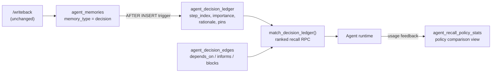

# Decision Ledger

> Ranked-recall sidecar for agent decisions — importance × step-recency × relevance scoring with dependency edges, usage feedback, and a per-policy recall report.



## What It Does

Adds a decisions ledger on top of the [Agent Memory schema](../agent-memory/): every `memory_type = 'decision'` write is auto-enrolled (via trigger — the write path doesn't change) with a **step index**, an adjustable **importance**, an optional **rationale**, and **dependency edges** to other decisions. A ranked-recall RPC, `match_decision_ledger()`, scores ledger entries by relevance × importance × step-recency × dependency degree instead of raw vector similarity — with a full-text fallback so recall works on a fully local stack with no embedding service at all.

Why: in Stefania Druga's memory-harness experiments (Sakana.ai, [AI Engineer 2026](https://www.youtube.com/watch?v=R3-anFK1YM8)), a ranked decisions ledger beat plain vector RAG on long-horizon recall — on both accuracy and token cost — and she argues recall policy should be a first-class metric. This schema implements that ledger and wires the metric into the recall traces OB1 already keeps.

## Prerequisites

- Working Open Brain setup ([guide](../../docs/01-getting-started.md)) — including the core capture path (`upsert_thought` → `public.thoughts`): ledger rows hang off memories whose thoughts arrive through it
- The [Agent Memory schema](../agent-memory/) (`agent_memories` and its sidecar tables must exist)
- Optional: the [Agent Memory API](../../integrations/agent-memory-api/) if you want the `recall_policy` patch in Step 3

## Credential Tracker

```text
DECISION LEDGER -- CREDENTIAL TRACKER
--------------------------------------

SUPABASE (from your Open Brain setup)
  Project URL:           ____________
  Secret key:            ____________

--------------------------------------
```

## Steps


1. Open the Supabase SQL Editor.
2. Paste the contents of [`schema.sql`](./schema.sql).
3. Run it.

**Done when:** Table Editor shows `agent_decision_ledger` and `agent_decision_edges`, and the Functions list shows `match_decision_ledger` and `touch_decision_recall`.


Insert a test decision and confirm the trigger enrolls it:

```sql
INSERT INTO agent_memories (workspace_id, task_id, memory_type, summary, content, confidence, metadata)
VALUES ('test-ws', 'test-task', 'decision', 'Test decision',
        'Decision: verify the ledger trigger works', 0.8,
        '{"rationale": "smoke test"}');

SELECT step_index, importance, rationale
FROM agent_decision_ledger
WHERE workspace_id = 'test-ws';
```

**Done when:** one ledger row exists with `step_index = 0`, `importance = 0.80`, and the rationale populated. (Pass `metadata.step_index` explicitly when your agent loop knows its own step; the max+1 fallback assumes one writer per task stream.)


To expose the ledger as a recall policy in the [Agent Memory API](../../integrations/agent-memory-api/), add two fields to `recallSchema` in `index.ts` (`current_step` must be a real schema field — zod strips unknown keys, so a cast can never see it):

```ts
recall_policy: z.enum(["vector", "ranked_ledger"]).default("vector"),
current_step: z.number().int().nullable().optional(),
```

Then, in the `/recall` handler, branch on the policy when computing the ranked list, before the vector path:

```ts
if (req.recall_policy === "ranked_ledger") {
  const { data: ledger, error: ledgerError } = await supabase.rpc("match_decision_ledger", {
    p_workspace_id: req.workspace_id,
    p_query: req.query,
    p_query_embedding: embedding,
    p_project_id: req.scope.project_only ? req.project_id ?? null : null,
    p_task_id: req.task_id ?? null,
    p_current_step: req.current_step ?? null,
    p_match_count: Math.max(req.limits.max_items * 4, 20),
  });
  if (ledgerError) return c.json({ error: ledgerError.message }, 500, corsHeaders);
  // Fetch the returned memory_ids from agent_memories, apply the same scope
  // filter, attach ledger[i].relevance / ledger[i].ranking_score, and reuse
  // the existing trace + recall-items + response tail.
}
```

Record the policy on every trace by extending the existing trace insert:

```ts
response_policy: { recall_policy: req.recall_policy, max_items: req.limits.max_items, include_unconfirmed: req.scope.include_unconfirmed },
```

Redeploy the Edge Function.

**Done when:** a `/recall` request with `"recall_policy": "ranked_ledger"` returns memories and its trace row carries `response_policy.recall_policy = "ranked_ledger"`.


After running tasks under different policies (and posting usage feedback to `/recall/:request_id/usage`), compare them:

```sql
SELECT * FROM agent_recall_policy_stats;
```

**Done when:** you see one row per policy with request volume, items returned, and used/ignored rates. This is the recall ladder: `vector` vs `ranked_ledger` side by side, and a `none` baseline is simply not calling `/recall`. For an oracle condition in evals, fetch the known-correct memory by id and inject it directly — then compare against the ladder.

## Expected Outcome

After the migration you have: `agent_decision_ledger` (one row per decision memory, auto-enrolled by trigger, with step index, importance, rationale, pin flag, and recall/usage counters), `agent_decision_edges` (`depends_on` / `informs` / `blocks` edges between decisions), the `match_decision_ledger()` ranking RPC, the `touch_decision_recall()` bookkeeping function, and the `agent_recall_policy_stats` view. Lifecycle state stays in `agent_memories` — supersede a decision through the normal review flow and it drops out of ranked recall automatically (pass `p_include_superseded => true` in eval runs to keep it visible with a scoring penalty).

The ranking formula, per row:

```text
score = 0.45 * relevance       (cosine similarity, or scaled full-text rank, or 0)
      + 0.25 * importance      (ledger value, initialized from confidence)
      + 0.15 * recency         (exp(-step_distance / 120), or wall-clock decay)
      + 0.15 * dependency      (live decisions depending on this one, capped at 3)
      - 0.30 if not active     (only reachable with p_include_superseded)
```

All weights and half-lives are function parameters — tune them per brain, and treat the view in Step 4 as the scoreboard for whether your tuning helps.

## Troubleshooting

**Issue: `decision-ledger requires public.agent_memories`**
Solution: Run [`schemas/agent-memory/schema.sql`](../agent-memory/schema.sql) first.

**Issue: ledger rows aren't created for my writebacks**
Solution: Only `memory_type = 'decision'` rows enroll. Check that your write-back payload puts decision text in the `decisions` array (the API maps it to that type), and that the trigger `trg_agent_decision_ledger_enroll` exists on `agent_memories`.

**Issue: `match_decision_ledger` returns rows but relevance is always 0**
Solution: You called it with neither `p_query_embedding` nor `p_query`. Pass the raw query text at minimum — the full-text fallback needs it. Ranking still works (importance/recency/structure), which is also the correct behavior for "no-query" core recall.

**Issue: two concurrent writers produced duplicate step_index values**
Solution: The max+1 fallback assumes a single writer per `(workspace, task)` stream. Concurrent writers should pass explicit `metadata.step_index` values from the agent loop's own step counter. Duplicate indexes don't break ranking; they only blur step-distance recency.
