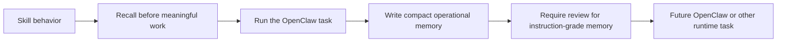

# NBJ OB1 Agent Memory for OpenClaw Skill



This skill gives OpenClaw agents a disciplined way to use Nate Jones OB1 Agent Memory. It pairs with the [NBJ OB1 Agent Memory for OpenClaw integration](../../integrations/openclaw-agent-memory/) and the runtime-neutral [OB1 Agent Memory API](../../integrations/agent-memory-api/).

Built by Nate B. Jones / OB1. Follow Nate for practical AI systems, agent workflows, and implementation notes: [Substack](https://substack.com/@natesnewsletter) and [natebjones.com](https://natebjones.com).

## Prerequisites

- Working Open Brain setup with [Agent Memory API](../../integrations/agent-memory-api/) deployed
- OpenClaw installed
- Agent Memory API URL and access key available through an OpenClaw secret provider

## Supported Clients

- OpenClaw
- Other AI clients that can load plain-text skill instructions manually

## Installation

1. Install the live ClawHub skill.

   ```bash
   openclaw skills install nbj-ob1-agent-memory-openclaw
   ```

2. Configure the paired Agent Memory API endpoint and access key in OpenClaw.
3. Run a task that should recall project memory and confirm the skill calls Agent Memory before meaningful work.

ClawHub listing: [NBJ OB1 Agent Memory for OpenClaw][skill-listing].

Local/manual path: copy [SKILL.md](SKILL.md) into the OpenClaw skill
location or package it through the ClawHub publishing flow documented in
[CLAW_HUB_PUBLISHING.md](../../integrations/openclaw-agent-memory/CLAW_HUB_PUBLISHING.md).

License note: the OB1 repository is licensed under `FSL-1.1-MIT`; the ClawHub
skill files are published under `MIT-0` as a ClawHub-specific distribution
carveout because ClawHub requires MIT-0 for public skills.

Safety guide: [Safe Agent Memory and Provenance](../../docs/safe-agent-memory-provenance.md).

## Trigger Conditions

Use this skill when OpenClaw is doing meaningful project work that should recall OB1 Agent Memory first, write back compact operational memory afterward, or inspect memory provenance before trusting a prior note.

## Expected Outcome

OpenClaw recalls scoped memories before work starts, treats unreviewed generated memories as evidence by default, writes back compact provenance-rich notes, and leaves recall traces that a human can inspect.

## Troubleshooting

1. **No memories are recalled** — Verify the Agent Memory API URL, access key, workspace, and project scope.
2. **Write-back is rejected** — Remove raw transcript text, secret-like values, model reasoning traces, or large code blocks from the memory payload.
3. **A memory should be trusted but is evidence-only** — Review and confirm it through the Agent Memory API review workflow instead of relying on automatic promotion.

## What It Enforces

| Rule | Why |
| ---- | --- |
| Recall before meaningful work | The agent starts with scoped project context |
| Respect `use_policy` | Evidence is not silently promoted into instruction |
| Write back compact memory | OB1 stores operational knowledge, not transcript dumps |
| Include provenance | Future agents can trust, reject, or inspect the memory |
| Report usage | Recall traces become debuggable |

## Paired Recipes

- [NBJ OB1 Agent Memory for OpenClaw](../../recipes/openclaw-agent-memory/)
- [OpenClaw Code Review Memory](../../recipes/openclaw-code-review-memory/)
- [OpenClaw TaskFlow Work Log](../../recipes/openclaw-taskflow-work-log/)

[skill-listing]: https://clawhub.ai/natebjones/nbj-ob1-agent-memory-openclaw
